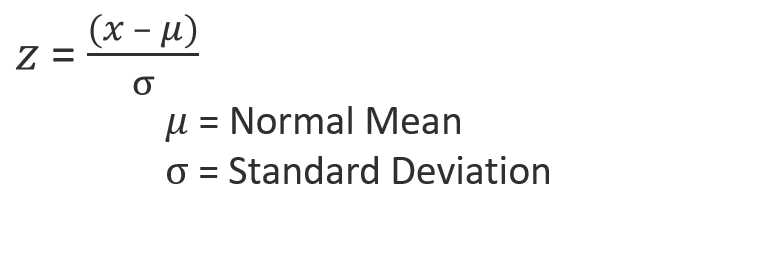
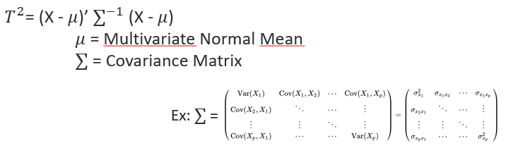
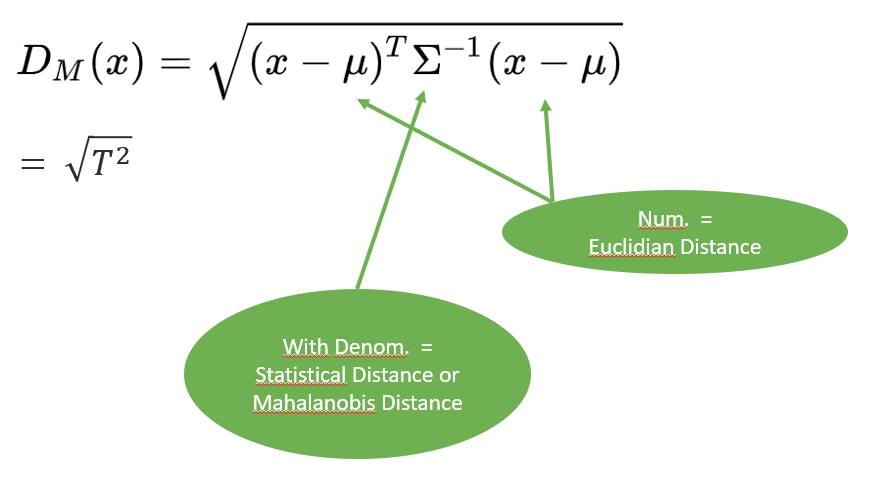
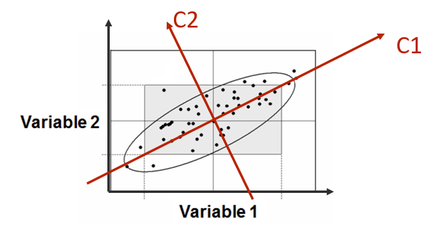
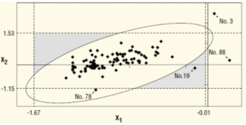

# TSquared
Python implementation of Hotelling's T2 for process monitoring + MYT decomposition

## Table of Contents:

[- Features](#features)
[- Specific Implementation](#impl)

## <a name="features">Features </a>

1. Classical multivariate T2 chart in which Hotelling’s T 2 statistic is computed as a distance of a multivariate observation from the multivariate mean scaled by the covariance matrix of the variables
2. Python scikit-learn -like implementation
3. Efficient with large datasets
4. MYT decomposition

## <a name="impl">Specific Implementation</a>

Hotelling’s T2 is initially for sampled distribution comparison to a reference distribution,
known as a generalization of the t-statistic for multivariate hypothesis testing.

For monitoring, only a single multivariate observation is compared to a reference distribution.
This is more a generalization of the z-score.

### Relationship between z-score and TSquared 

X is in this case the observation (point) in the multivariate space.

The covariance matrix of the reference multivariate distribution is formed by covariance terms between each dimensions and by variance terms (square of standard deviations) on the diagonal.

## Questions
#### How TSquared is related to T-Test?

See answer above!

#### How TSquared is related to Mahalanobis Distance?

#### Should I use PCA with TSquared?

Yes, you can!

But this should be done cautiously

1. PCA defines new coordonates for each points
2. PCA is often used to reduce dimensionality by selecting the strongest « principal » components defining the underlying relation between variables
3. T2 score on all PCA components = T2 on all original variables 

Can we apply T2 on a reduced number of (principal) components?
Let's try a 2D example. In the following picture, the relation between Var1 and Var2 is mostly linear, these variables are strongly correlated. Let's suppose that the 1st component of the PCA is sufficient to define the relation, component 2 being the noisy part of the relation.

In this case, monitoring any futur observation is like applying a z-score (1 dimension) to this observation compared to the distribution of all past observations projected on the first component axis.

If a loss of correlation happened between Var1 and Var2, it won't be seen on this univariate monitoring because it is the second component that will be impacted.

By extension to more dimensions, we understand that reducing "blindly" the number of components before a TSquared monitoring is not advised. 

Instead, if PCA is used to reduce the dimensionnality, it is advised to monitor as well the residual group of components in a separated monitoring.

#### Can I apply T-Squared to any kind of process?

#### What are the conditions on parameters to use T-Squared?

#### Should I clean dataset before training? Is there a procedure to clean the data?

Yes, the cleaner the better

The TSquared procedure can be applied 1 or 2 times to the training set and outliers can be filtered at each round.

The risk to work with a training set not clean is to have an univariate outlier which is an inlier in multivariate, the multivariate UCL being too large (Observation n°78).

#### What variables cause the outlier? 

#### What is MYT decomposition?

#### How deviation types impact T-Squared?

#### Is a T-Squared monitoring sufficient? Or do I still need univariate monitoring?

#### UCL, what does that mean in multivariate context?

#### How to compute UCL?

## References

- <cite> Decomposition of T2 for Multivariate Control Chart Interpretation, ROBERT L. MASON, NOLA D. TRACY and JOHN C. YOUNG </cite>

	[Decomposition of T2 for Multivariate Control Chart Interpretation]: ../Références/Decomposition%20of%20T2%20for%20Multivariate%20Control%20Chart%20Interpretation.pdf

- <cite> Application of Multivariate Statistical Quality Control In Pharmaceutical Industry, Mesut ULEN, Ibrahim DEMIR </cite>

  [Application of Multivariate Statistical Quality Control In Pharmaceutical Industry]: ../Références/Application%20of%20Multivariate%20Statistical%20Quality%20Control%20In%20Pharmaceutical%20Industry.pdf

- <cite> Identifying Variables Contributing to Outliers in Phase I, ROBERT L. MASON, YOUN-MIN CHOU, AND JOHN C. YOUNG </cite>

  [Identifying Variables Contributing to Outliers in Phase I]: ../Références/Identifying%20variables%20contributing%20to%20outliers%20in%20Phase%20I.pdf

- <cite> Multivariate Control Charts for Individual Observations, NOLA D. TRACY, JOHN C. YOUNG, ROBERT L. MASON </cite>

  [Multivariate Control Charts for Individual Observations]: ../Références/Multivariate%20control%20charts%20for%20individual%20observations.pdf
<!---

--->
<!---

--->

