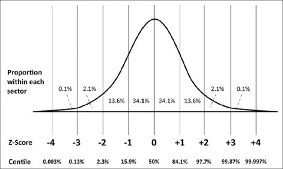
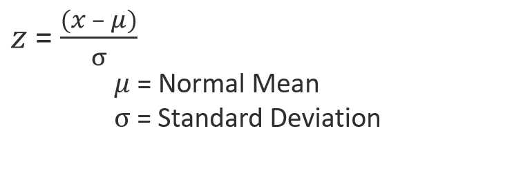
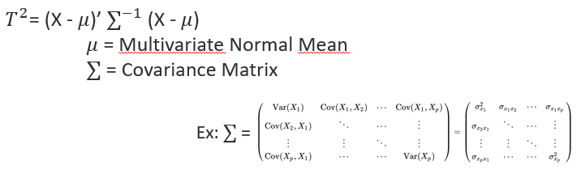

# TSquared

Python implementation of Hotelling's T-squared (T2) for process monitoring and MYT decomposition.

## Table of Contents

1. [Features](#features)
2. [Installation](#installation)
3. [Questions](#questions)
	- [How TSquared is related to t-test?](#questions_ttest)
	- [How TSquared is related to Mahalanobis Distance?](#questions_mahalanobis_dist)
	- [How TSquared is related to MCD?](#questions_mcd)
	- [Should I use PCA with TSquared?](#questions_pca)
	- [Can I apply TSquared to any kind of process? What are the conditions on parameters to use TSquared?](#questions_conditions)
	- [Should I clean dataset before training? Is there a procedure to clean the data?](#questions_cleaning)
	- [What variables cause the outlier? What is MYT decomposition?](#questions_myt)
	- [How deviation types impact TSquared?](#questions_types)
	- [Is a TSquared monitoring sufficient? Or do I still need univariate monitoring?](#questions_sufficient)
	- [UCL, what does that mean in multivariate context? How to compute UCL?](#questions_ucl)
	- [My data are not normally distributed. Does it help to apply a Box-Cox transformation on each variables?](#questions_boxcox)
4. [References](#references)

## <a name="features"></a> Features

1. Classical multivariate T2 chart in which Hotelling's T2 statistic is computed as a distance of a multivariate observation from the multivariate mean scaled by the covariance matrix of the variables
2. Python scikit-learn -like implementation
3. Efficient with large datasets
4. MYT decomposition

## <a name="installation"></a> Installation

TSquared requires:

- Python (>= 3.6)
- NumPy
- Pingouin
- scikit-learn
- SciPy

TSquared can be installed from PyPI:

```sh
pip install tsquared
```

## <a name="questions"></a> Questions

### <a name="questions_ttest"></a> How TSquared is related to t-test?

Hotelling's T2 is a generalization of the t-statistic for multivariate hypothesis testing
When a single multivariate observation is compared to a reference distribution, it can be viewed as a generalization of the z-score.
The difference is the nature of the entities (point >< distribution) that are considered in the distance computation and in the denominator of the equation also.


What's the relationship with z-score then?

<a href="figures/equ_zscore.png"></a>


X is in this case the observation (point) in the multivariate space.

The covariance matrix of the reference multivariate distribution is formed by covariance terms between each dimensions and by variance terms (square of standard deviations) on the diagonal.

### <a name="questions_mahalanobis_dist"></a> How TSquared is related to Mahalanobis Distance?


### <a name="questions_mcd"></a> How TSquared is related to MCD?

MCD = minimum covariance determinant is an algorithm available in the Outlier Detection framework pyOD
MCD is based on Mahalanobis Squared Distance (MSD =~ Hotelling's T2)
Based on the distribution of MSD, the training consists to find the subgroup of points ($h < n$) that minimizes the covariance determinant. This subgroup of points can be thought of as the minimum number of points which must not be outlying (with $h > n/2$ to keep a sufficient number of point)

⟹ It is equivalent to the cleaning operation in TSquared.

### <a name="questions_pca"></a> Should I use PCA with TSquared?

Yes, you can!

But this should be done cautiously

1. PCA defines new coordinates for each points
2. PCA is often used to reduce dimensionality by selecting the strongest "principal" components defining the underlying relation between variables
3. T2 score on all PCA components = T2 on all original variables 

Can we apply T2 on a reduced number of (principal) components?
Let's try a 2D example. In the following picture, the relation between Var1 and Var2 is mostly linear, these variables are strongly correlated. Let's suppose that the first component of the PCA is sufficient to define the relation, second component being the noisy part of the relation.


In this case, monitoring any future observation is like applying a z-score (1 dimension) to this observation compared to the distribution of all past observations projected on the first component axis.

If a loss of correlation happened between Var1 and Var2, it won't be seen on this univariate monitoring because it is the second component that will be impacted. This can happened if the sensor capturing Var2 is defective. 

By extension to more dimensions, we understand that reducing "blindly" the number of components before a TSquared monitoring is not advised. It is certainly not a thing to do in case of sensors validation.

Instead, if PCA is used to reduce the dimensionality, it is advised to monitor as well the residual group of components in a separated monitoring.

### <a name="questions_conditions"></a> Can I apply TSquared to any kind of process? What are the conditions on parameters to use TSquared?

The basic assumption is that all variables should be normally distributed. 
However, the algorithm is tolerant to some extent if the distributions are not perfectly normal.

### <a name="questions_cleaning"></a> Should I clean dataset before training? Is there a procedure to clean the data?

Yes, the cleaner the better

The TSquared procedure can be applied 1 or 2 times to the training set and outliers can be filtered at each round.

The risk to work with a training set not clean is to have an univariate outlier which is an inlier in multivariate, the multivariate UCL being too large (Observation n°78).


### <a name="questions_myt"></a> What variables cause the outlier? What is MYT decomposition?

### <a name="questions_types"></a> How deviation types impact TSquared?

### <a name="questions_sufficient"></a> Is a TSquared monitoring sufficient? Or do I still need univariate monitoring?

### <a name="questions_ucl"></a> UCL, what does that mean in multivariate context? How to compute UCL?

### <a name="questions_boxcox"></a> My data are not normally distributed. Does it help to apply a Box-Cox transformation on each variables?

The experiment was done using TSquared auto-cleaning function and Box-Cox transformation on each variables.

## <a name="references"></a> References

- <cite> Decomposition of T2 for Multivariate Control Chart Interpretation, ROBERT L. MASON, NOLA D. TRACY and JOHN C. YOUNG</cite>

	[Decomposition of T2 for Multivariate Control Chart Interpretation]: ../Références/Decomposition%20of%20T2%20for%20Multivariate%20Control%20Chart%20Interpretation.pdf

- <cite> Application of Multivariate Statistical Quality Control In Pharmaceutical Industry, Mesut ULEN, Ibrahim DEMIR</cite>

	[Application of Multivariate Statistical Quality Control In Pharmaceutical Industry]: ../Références/Application%20of%20Multivariate%20Statistical%20Quality%20Control%20In%20Pharmaceutical%20Industry.pdf

- <cite> Identifying Variables Contributing to Outliers in Phase I, ROBERT L. MASON, YOUN-MIN CHOU, AND JOHN C. YOUNG</cite>

	[Identifying Variables Contributing to Outliers in Phase I]: ../Références/Identifying%20variables%20contributing%20to%20outliers%20in%20Phase%20I.pdf

- <cite> Multivariate Control Charts for Individual Observations, NOLA D. TRACY, JOHN C. YOUNG, ROBERT L. MASON</cite>

	[Multivariate Control Charts for Individual Observations]: ../Références/Multivariate%20control%20charts%20for%20individual%20observations.pdf

<!---



--->
<!---
<a href="https://github.com/cetic/TSquared/tree/master/figures/z-score.jpg"></a>
--->
